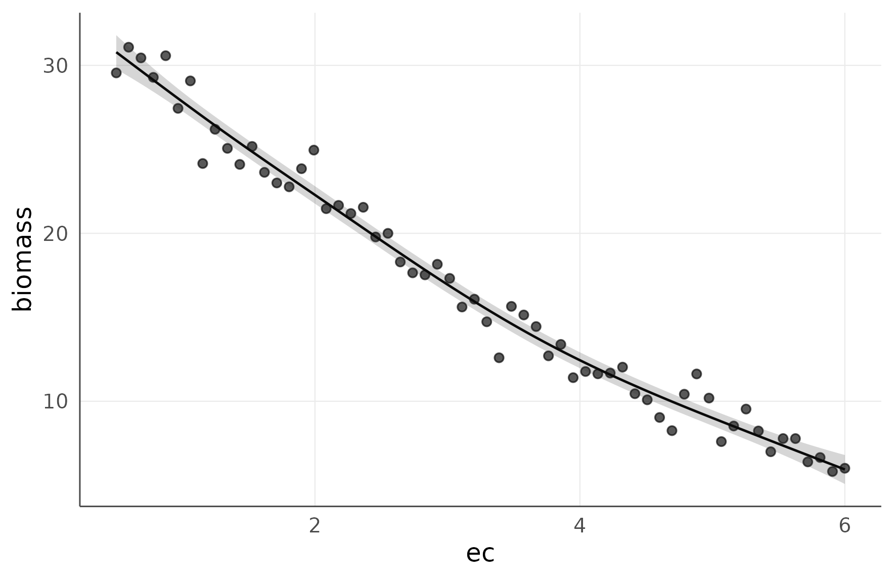
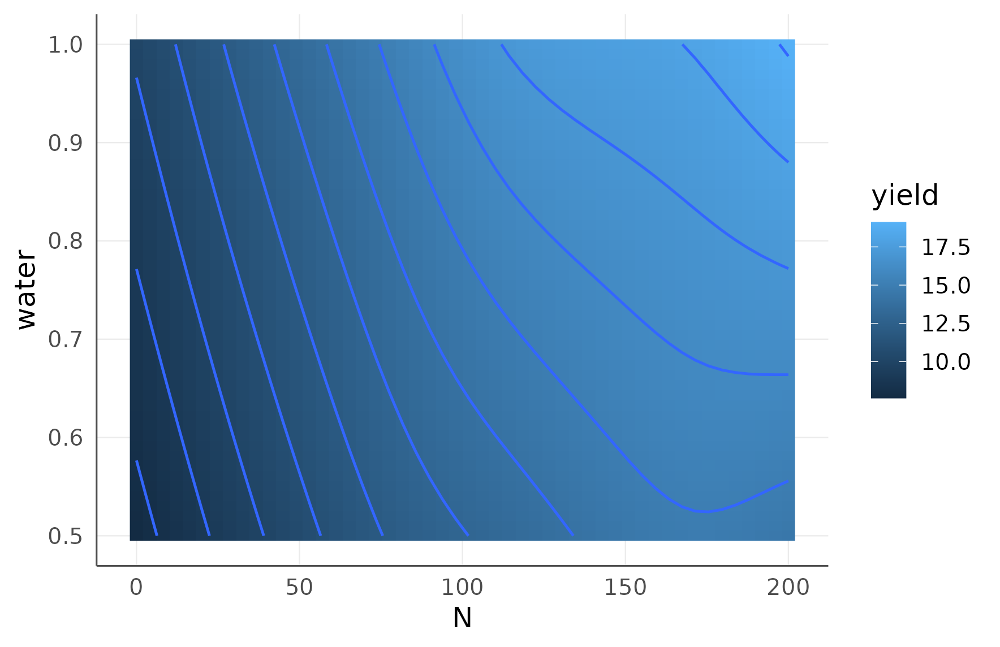
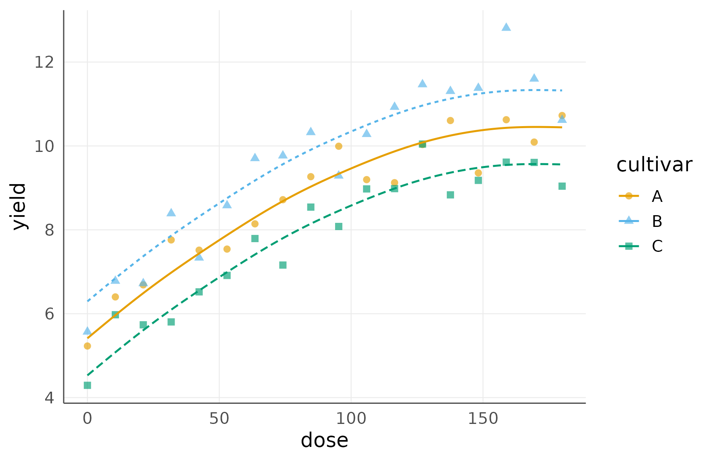

# Nonparametric and Shape-Aware Regression for Agronomic Gradients

**Regression vignette** **Package:** `agriRank` **Version targeted:**
`0.14.0` **Owns:** fitting a curve to a quantitative agronomic gradient
without assuming its functional form.

------------------------------------------------------------------------

## 1. Why this vignette exists

A fertilizer rate, a salinity level, an irrigation depth and a sowing
density are not categories. They lie on a scale, and the scientific
content of the experiment is the **shape** of the response along that
scale.

The habitual analysis, comparing four or five rates as unrelated
categories, answers a question nobody asked and reports letters where a
curve belongs. The habitual alternative, fitting a quadratic because it
is available, imposes a shape the biology did not promise: a quadratic
is symmetric about its peak and falls away as fast as it rose, which
almost no crop response does.

This vignette fits curves without imposing a functional form, and where
a shape **is** known from the biology, it imposes that shape rather than
a convenient polynomial.

> **Let the data choose the shape, unless the biology already fixed it.
> Never let a p-value choose the engine.**

### 1.1 Where this sits

| Stage | Vignette |
|----|----|
| declaring the design the curve is fitted inside | *Design Foundations* |
| the factorial alternative to a curve | *Effects, Conover, Contrasts, and Factorial Inference* |
| whole-number treatments | *Integer-Support Nonparametric Regression* |
| where the response stops changing, and intervals for a plot | *Distribution-Free Uncertainty and Model Checking* |
| a rate to recommend, with an interval on its location | *Optima, Quantiles, and How the Block Enters the Model* |

This vignette produces the curve. Those two turn it into a
recommendation.

------------------------------------------------------------------------

## 2. Learning objectives

After working through this vignette, the reader should be able to:

1.  decide whether a quantitative treatment should be analysed as a
    factor, as a gradient, or as both;
2.  name the fifteen engines available and say which family each belongs
    to;
3.  choose an engine from the structure of the data and the biology, not
    from the fit;
4.  impose a shape constraint when the biology fixes the shape, and
    explain what the constraint buys;
5.  retain a declared block in a regression, and recognise the engines
    that cannot;
6.  read the three explained-variation indices and say what each one
    answers;
7.  compare engines predictively without letting the comparison feed
    back into inference;
8.  produce a resampling band for an engine with no analytic interval;
9.  fit and read a response surface over two gradients;
10. fit one curve per level of a qualitative factor;
11. test whether a prespecified parametric equation is too restrictive,
    without adopting it;
12. handle missing values explicitly rather than by silent deletion.

------------------------------------------------------------------------

## 3. The regression module in one map

### 3.1 The engines, by family

``` r

data.frame(
  engine = c("loess", "smoothing_spline", "kernel", "isotonic", "cobs",
             "discrete_kernel", "unimodal_isotonic",
             "umbrella", "integer_grid",
             "theil_sen", "siegel", "quantile", "smooth_quantile",
             "gam", "scam"),
  family = c(rep("strictly nonparametric", 7),
             rep("constrained / projected", 2),
             rep("rank-robust or semiparametric", 6))[1:15],
  shape_imposed = c("none", "none", "none", "monotone", "as declared",
                    "none", "one peak", "one peak", "none",
                    "none", "none", "none", "none", "none", "as declared")
)
#>               engine                        family shape_imposed
#> 1              loess        strictly nonparametric          none
#> 2   smoothing_spline        strictly nonparametric          none
#> 3             kernel        strictly nonparametric          none
#> 4           isotonic        strictly nonparametric      monotone
#> 5               cobs        strictly nonparametric   as declared
#> 6    discrete_kernel        strictly nonparametric          none
#> 7  unimodal_isotonic        strictly nonparametric      one peak
#> 8           umbrella       constrained / projected      one peak
#> 9       integer_grid       constrained / projected          none
#> 10         theil_sen rank-robust or semiparametric          none
#> 11            siegel rank-robust or semiparametric          none
#> 12          quantile rank-robust or semiparametric          none
#> 13   smooth_quantile rank-robust or semiparametric          none
#> 14               gam rank-robust or semiparametric          none
#> 15              scam rank-robust or semiparametric   as declared
```

### 3.2 The functions

| Function | Answers |
|----|----|
| [`agri_np_regression()`](https://wep69.github.io/agriRank/reference/agri_np_regression.md) | fit a curve |
| [`agri_np_predict()`](https://wep69.github.io/agriRank/reference/agri_np_predict.md) | predict, with an analytic interval where one is defined |
| [`agri_np_plot()`](https://wep69.github.io/agriRank/reference/agri_np_plot.md) | the standard figures |
| [`agri_np_derivative()`](https://wep69.github.io/agriRank/reference/agri_np_derivative.md) | the slope of the fitted curve |
| [`agri_np_optimum()`](https://wep69.github.io/agriRank/reference/agri_np_optimum.md) | the fitted extreme, as a bare point |
| [`agri_np_bootstrap()`](https://wep69.github.io/agriRank/reference/agri_np_bootstrap.md) | a resampling band for the curve |
| [`agri_np_compare()`](https://wep69.github.io/agriRank/reference/agri_np_compare.md) | predictive comparison of engines |
| [`agri_np_diagnostics()`](https://wep69.github.io/agriRank/reference/agri_np_diagnostics.md) | explained variation and predictive error |
| [`agri_np_curves()`](https://wep69.github.io/agriRank/reference/agri_np_curves.md) | several engines overlaid on the data |
| [`agri_np_significance()`](https://wep69.github.io/agriRank/reference/agri_np_significance.md) | bootstrap tests for kernel fits |
| [`agri_np_specification()`](https://wep69.github.io/agriRank/reference/agri_np_specification.md) | is a prespecified equation too restrictive |

------------------------------------------------------------------------

## Part I. Factor or gradient?

## 4. The decision is about the treatment, not the fit

Nitrogen applied at 0, 40, 80, 120 and 160 kg/ha can be analysed two
ways.

| As a factor | As a gradient |
|----|----|
| assumes nothing about the shape between levels | assumes the response varies smoothly between them |
| answers: do these five levels differ | answers: what shape, and where is it changing |
| cannot interpolate | can interpolate, inside the tested range |
| spends 4 degrees of freedom | spends fewer, and gains precision if the shape is real |
| output: letters | output: a curve |

Decide on scientific grounds. If the levels were chosen as points on a
continuum and interpolation between them is meaningful, the gradient
analysis answers the real question. If they are distinct managements
that happen to carry numeric labels, they are a factor.

### 4.1 Reporting both is not indecision

They answer different questions. A manuscript that reports only the
factorial analysis of a quantitative treatment has left the shape of the
response undescribed, which is usually the part a reader wants.

------------------------------------------------------------------------

## Part II. The strictly nonparametric engines

## 5. A first fit

``` r

set.seed(2001)
dose_data <- data.frame(dose = seq(0, 220, length.out = 55))
dose_data$yield <- 5.2 + 0.075 * dose_data$dose -
  0.00022 * dose_data$dose^2 + rnorm(nrow(dose_data), 0, 0.65)

fit_ss <- agri_np_regression(
  yield ~ dose,
  data   = dose_data,
  method = "smoothing_spline"
)
fit_ss
#> agriRank nonparametric regression
#>   Method: smoothing_spline
#>   Response: yield
#>   Predictors: dose
```

### 5.1 The standard interrogation

``` r

agri_np_predict(fit_ss, data.frame(dose = c(50, 100, 150, 200)))
#> [1]  8.410741 10.597941 11.747697 11.210962
agri_np_diagnostics(fit_ss)
#> $method
#> [1] "smoothing_spline"
#> 
#> $metrics
#>    n      RMSE       MAE    MedAE         bias  Spearman
#> 1 55 0.5869064 0.4823941 0.404772 -4.57554e-12 0.9120491
#> 
#> $r2
#>   pseudo_r2 cv_r2 spearman_r2 effective_df  n
#> 1 0.9145779    NA   0.8318335     4.896585 55
#> 
#> $residual_median
#> [1] -0.01555434
#> 
#> $residual_MAD
#> [1] 0.6231758
#> 
#> $residual_fitted_spearman
#> [1] 0.03506494
#> 
#> $n_missing_response
#> [1] 0
#> 
#> $n_original
#> [1] 55
#> 
#> $n_omitted
#> [1] 0
#> 
#> $na_action
#> [1] "fail"
#> 
#> $details
#> $details$df
#> [1] 4.896585
#> 
#> $details$spar
#> [1] 0.8110458
```

``` r

head(agri_np_derivative(fit_ss))
#>   predictor        x derivative
#> 1      dose 0.000000 0.06485649
#> 2      dose 1.105528 0.06486016
#> 3      dose 2.211055 0.06487125
#> 4      dose 3.316583 0.06488977
#> 5      dose 4.422111 0.06491461
#> 6      dose 5.527638 0.06493196
agri_np_optimum(fit_ss)
#>   predictor  optimum fitted_response objective at_boundary    support
#> 1      dose 154.7495         11.7568       max       FALSE continuous
```

### 5.2 The figures

``` r

agri_np_plot(fit_ss, type = "fit")
```


Fitted curve over the observed points. The observed data are shown
because a curve without them cannot be judged.

``` r

agri_np_plot(fit_ss, type = "derivative")
```


The slope of the fitted curve. Where it crosses zero is where the fitted
response turns over.

### 5.3 What a smoothing spline assumes

It assumes the response is **smooth**, and it chooses how smooth by
cross-validation. It does not assume a functional form, monotonicity, or
a single peak.

That freedom has a cost: with few distinct predictor values, or with
noise comparable to the signal, the fitted curve can follow features
that are not there. Section 9 gives the diagnostic that reveals it.

### 5.4 Interpretation

Report the fitted curve **with the observed points**, always. A smooth
line without data is not evidence; it is a drawing.

------------------------------------------------------------------------

## 6. Shape constraints, when the biology fixes the shape

### 6.1 The situation

Some agronomic responses have a known direction. Biomass does not rise
with salinity. Germination does not fall with temperature over the
sub-optimal range. Where that knowledge exists, imposing it is not an
assumption added to the data: it is information the data did not have to
spend degrees of freedom rediscovering.

``` r

set.seed(2002)
sal <- data.frame(ec = seq(0.5, 6.0, length.out = 60))
sal$biomass <- 31 * exp(-0.12 * sal$ec^1.45) + rnorm(nrow(sal), 0, 1.1)

fit_iso <- agri_np_regression(
  biomass ~ ec,
  data   = sal,
  method = "isotonic",
  shape  = "decreasing"
)
fit_iso
#> agriRank nonparametric regression
#>   Method: isotonic
#>   Response: biomass
#>   Predictors: ec
#>   Shape constraint: decreasing
```

``` r

agri_np_plot(fit_iso)
```


Isotonic regression with a declared decreasing constraint. The fit is a
step function, which is what the method estimates.

### 6.2 Isotonic regression fits steps, and that is honest

The fitted object is a step function, not a smooth curve. That is not a
limitation to be hidden: isotonic regression estimates the best
**monotone** function, and the best monotone fit to finite noisy data is
a step function. Drawing a smooth line through it would suggest a
precision the estimate does not have.

### 6.3 A smooth constrained alternative

``` r

if (requireNamespace("scam", quietly = TRUE)) {
  fit_scam <- agri_np_regression(
    biomass ~ ec,
    data   = sal,
    method = "scam",
    shape  = "decreasing"
  )
  print(agri_np_plot(fit_scam, interval = TRUE))
}
```



SCAM imposes the same monotone constraint but through a penalized spline
basis, so the result is smooth and carries an analytic interval. Where a
smooth constrained curve is wanted for presentation, this is the route.

### 6.4 The available constraints

``` r

data.frame(
  shape = c("increasing", "decreasing", "convex", "concave",
            "increasing_convex", "increasing_concave",
            "decreasing_convex", "decreasing_concave"),
  agronomic_example = c(
    "germination over sub-optimal temperature",
    "biomass over salinity",
    "cost over input rate",
    "yield over a nutrient below the optimum",
    "accelerating growth phase",
    "diminishing returns to fertilizer",
    "decelerating decline",
    "accelerating decline under stress")
)
#>                shape                        agronomic_example
#> 1         increasing germination over sub-optimal temperature
#> 2         decreasing                    biomass over salinity
#> 3             convex                     cost over input rate
#> 4            concave  yield over a nutrient below the optimum
#> 5  increasing_convex                accelerating growth phase
#> 6 increasing_concave        diminishing returns to fertilizer
#> 7  decreasing_convex                     decelerating decline
#> 8 decreasing_concave        accelerating decline under stress
```

### 6.5 The constraint must come from biology, not from the plot

``` r

# Isotonic regression requires an explicit direction. It will not infer one.
agri_np_regression(biomass ~ ec, sal, method = "isotonic")
#> Error:
#> ! Isotonic regression requires an explicit scientific direction: `shape = 'increasing'` or `shape = 'decreasing'`.
```

Choosing the constraint after looking at the scatter is fitting the data
twice: once to pick the shape and once to estimate it. The stated
uncertainty then does not cover the first step.

### 6.6 Interpretation

Report the constraint, and the biological reason for it, in the methods.
A constrained fit whose constraint is not justified is a stronger claim
than an unconstrained one, not a weaker one.

------------------------------------------------------------------------

## Part III. Keeping the design

## 7. A block in a regression

``` r

set.seed(2003)
rcbd <- expand.grid(
  block = factor(1:5),
  N     = seq(0, 200, length.out = 12)
)
rcbd$yield <- 6 + 0.075 * rcbd$N - 0.00021 * rcbd$N^2 +
  as.numeric(rcbd$block) * 0.35 + rnorm(nrow(rcbd), 0, 0.55)

if (requireNamespace("mgcv", quietly = TRUE)) {
  fit_gam <- agri_np_regression(
    yield ~ N,
    data   = rcbd,
    method = "gam",
    block  = block
  )
  print(summary(fit_gam))
}
#> agriRank nonparametric regression summary
#> Method: gam
#> 
#>   n      RMSE       MAE     MedAE         bias  Spearman
#>  60 0.4620908 0.3867066 0.3589656 3.256722e-16 0.9569325
#> 
#> Backend summary:
#> 
#> Family: gaussian 
#> Link function: identity 
#> 
#> Formula:
#> yield ~ s(N, k = 10) + block
#> 
#> Parametric coefficients:
#>             Estimate Std. Error t value Pr(>|t|)    
#> (Intercept)  10.7924     0.1450  74.406  < 2e-16 ***
#> block2        0.4741     0.2051   2.311   0.0249 *  
#> block3        1.1968     0.2051   5.835 3.78e-07 ***
#> block4        1.2390     0.2051   6.040 1.80e-07 ***
#> block5        1.5419     0.2051   7.517 8.58e-10 ***
#> ---
#> Signif. codes:  0 '***' 0.001 '**' 0.01 '*' 0.05 '.' 0.1 ' ' 1
#> 
#> Approximate significance of smooth terms:
#>        edf Ref.df     F p-value    
#> s(N) 4.253  5.234 215.5  <2e-16 ***
#> ---
#> Signif. codes:  0 '***' 0.001 '**' 0.01 '*' 0.05 '.' 0.1 ' ' 1
#> 
#> R-sq.(adj) =  0.953   Deviance explained =   96%
#> -REML = 51.585  Scale est. = 0.25246   n = 60
```

``` r

if (exists("fit_gam")) print(agri_np_plot(fit_gam, predictor = "N", interval = TRUE))
```


Block-adjusted fitted response with its analytic interval. The band
covers the curve, not a plot.

### 7.1 Engines that cannot carry a block are refused

``` r

agri_np_regression(yield ~ N, rcbd, method = "loess", block = block)
#> Error:
#> ! Method `loess` does not adjust for the declared block in agriRank. Use kernel, quantile, GAM or SCAM, or omit block only when scientifically justified.
```

The refusal is the same principle as in the design vignette. LOESS fits
a curve in one predictor and has no mechanism for an adjustment factor.
Applying it to blocked data would leave the between-block variation in
the residual, which is what blocking removed.

### 7.2 Which engines keep a block

``` r

data.frame(
  keeps_block = c("gam", "scam", "kernel", "quantile", "smooth_quantile",
                  "umbrella", "integer_grid"),
  refuses_block = c("loess", "smoothing_spline", "theil_sen", "siegel",
                    "cobs", "isotonic", "unimodal_isotonic")
)
#>       keeps_block     refuses_block
#> 1             gam             loess
#> 2            scam  smoothing_spline
#> 3          kernel         theil_sen
#> 4        quantile            siegel
#> 5 smooth_quantile              cobs
#> 6        umbrella          isotonic
#> 7    integer_grid unimodal_isotonic
```

### 7.3 Interpretation

If the experiment was blocked, the regression must keep the block. If
the preferred engine cannot, the choice is between a different engine
and a justified decision to ignore the blocking, and the second requires
an argument in the methods.

------------------------------------------------------------------------

## 8. Quantile regression, and the other engines

### 8.1 Conditional quantiles

``` r

if (requireNamespace("quantreg", quietly = TRUE)) {
  fit_q50 <- agri_np_regression(yield ~ N, rcbd, method = "quantile",
                                tau = 0.50, block = block)
  fit_q10 <- agri_np_regression(yield ~ N, rcbd, method = "quantile",
                                tau = 0.10, block = block)
  nd <- rcbd[1:5, ]
  print(data.frame(N = nd$N,
                   q50 = round(as.numeric(agri_np_predict(fit_q50, nd)), 2),
                   q10 = round(as.numeric(agri_np_predict(fit_q10, nd)), 2)))
}
#> Warning in rq.fit.br(x, y, tau = tau, ...): Solution may be nonunique
#>   N  q50  q10
#> 1 0 7.53 6.37
#> 2 0 7.80 7.33
#> 3 0 8.29 8.22
#> 4 0 9.13 7.60
#> 5 0 9.22 8.15
```

The median describes the typical plot; the tenth percentile describes
the plot a grower meets in a bad year. A treatment that raises one
without the other changes the risk, not only the level, and the two are
different recommendations. The smooth version and the full fan of
quantiles belong to *Optima, Quantiles, and How the Block Enters the
Model*.

### 8.2 Kernel regression with mixed predictor types

``` r

if (requireNamespace("np", quietly = TRUE)) {
  set.seed(2004)
  kd <- expand.grid(
    cultivar = factor(c("A", "B")),
    dose     = seq(0, 180, length.out = 20)
  )
  kd$yield <- 5 + 0.06 * kd$dose - 0.00018 * kd$dose^2 +
    ifelse(kd$cultivar == "B", 1.2, 0) + rnorm(nrow(kd), 0, .45)
  fit_kernel <- agri_np_regression(yield ~ dose + cultivar, kd,
                                   method = "kernel")
  print(agri_np_diagnostics(fit_kernel))
}
#> $method
#> [1] "kernel"
#> 
#> $metrics
#>    n      RMSE       MAE     MedAE       bias  Spearman
#> 1 40 0.3726883 0.2957533 0.2061477 0.07310834 0.9681051
#> 
#> $r2
#>   pseudo_r2 cv_r2 spearman_r2 effective_df  n
#> 1 0.9540871    NA   0.9372274           NA 40
#> 
#> $residual_median
#> [1] 0.05120071
#> 
#> $residual_MAD
#> [1] 0.3416752
#> 
#> $residual_fitted_spearman
#> [1] 0.03939962
#> 
#> $n_missing_response
#> [1] 0
#> 
#> $n_original
#> [1] 40
#> 
#> $n_omitted
#> [1] 0
#> 
#> $na_action
#> [1] "fail"
#> 
#> $details
#> $details$bandwidth
#> 
#> Regression Data (40 observations, 2 variable(s)):
#> 
#>                   dose   cultivar
#> Bandwidth(s): 24.47498 0.03045118
#> 
#> Regression Type: Local-Linear
#> Bandwidth Selection Method: Expected Kullback-Leibler Cross-Validation
#> Formula: yield ~ dose + cultivar
#> Bandwidth Type: Fixed
#> Objective Function Value: -0.3224155 (achieved on multistart 1)
#> Number of Function Evaluations: 316
#> Evaluation cache (Powell): 121 hits / 293 lookups (41.3%)
#> 
#> Continuous Kernel Type: Second-Order Gaussian
#> No. Continuous Explanatory Vars.: 1
#> 
#> Unordered Categorical Kernel Type: Aitchison and Aitken
#> No. Unordered Categorical Explanatory Vars.: 1
```

Kernel regression handles continuous and categorical predictors in one
fit, with bandwidths chosen by cross-validation. It is the most flexible
engine here and the most data-hungry.

### 8.3 Rank-robust slopes

Theil-Sen and Siegel regression estimate a slope as a median of pairwise
slopes. They are the natural choice when the relationship is close to
linear and a few extreme plots would dominate an ordinary fit. They also
return interpretable coefficients, which the smoothers deliberately do
not.

``` r

ts_fit <- agri_np_regression(yield ~ dose, dose_data, method = "theil_sen")
coef(ts_fit)
#> (Intercept)        dose 
#>  7.18408725  0.02792083
confint(ts_fit)
#>          term   estimate      lower      upper  method
#> 1 (Intercept) 7.18408725 6.57301994 7.25400571 backend
#> 2        dose 0.02792083 0.02602338 0.02894238 backend
```

### 8.4 Why the smoothers refuse coefficients

``` r

coef(fit_ss)
#> Error:
#> ! Method `smoothing_spline` does not define interpretable regression coefficients. It estimates a curve, not a finite parameter vector. Use agri_np_predict(), agri_np_derivative() or agri_np_optimum() to describe the fitted response, and coef() only with theil_sen, siegel, quantile.
```

A smoothing spline has coefficients, but they are basis weights with no
agronomic meaning. Reporting one as “the effect of nitrogen” would
invite a reading the model does not support, so the package refuses by
name.

------------------------------------------------------------------------

## Part IV. Choosing an engine honestly

## 9. Explained variation, and what each index answers

``` r

agri_np_diagnostics(fit_ss, cv = TRUE, seed = 1)$r2
#>   pseudo_r2     cv_r2 spearman_r2 effective_df  n
#> 1 0.9145779 0.8823811   0.8318335     4.896585 55
```

| Index | Question | Fails to notice |
|----|----|----|
| `pseudo_r2` | how much variation does the fitted curve reproduce | overfitting: it always rises with flexibility |
| `cv_r2` | how much would it reproduce on a plot it has not seen | nothing, but it is noisy in small experiments |
| `spearman_r2` | how much of the **ordering** does it get right | the size of the departures |
| `effective_df` | how much flexibility was actually used | nothing; read it beside the other three |

### 9.1 The pattern that reveals overfitting

A flexible engine typically shows a **larger** `pseudo_r2`, a **larger**
`effective_df` and a **smaller** `cv_r2` than a rigid one on the same
data.

``` r

cmp <- do.call(rbind, lapply(c("smoothing_spline", "loess", "theil_sen"),
  function(m) {
    f <- agri_np_regression(yield ~ dose, dose_data, method = m)
    r <- agri_np_diagnostics(f, cv = TRUE, seed = 1)$r2
    data.frame(engine = m, pseudo_r2 = round(r$pseudo_r2, 3),
               cv_r2 = round(r$cv_r2, 3), edf = round(r$effective_df, 2))
  }))
cmp
#>             engine pseudo_r2 cv_r2 edf
#> 1 smoothing_spline     0.915 0.882 4.9
#> 2            loess     0.913 0.863 4.4
#> 3        theil_sen     0.666 0.596 2.0
```

Read the gap between `pseudo_r2` and `cv_r2`. A large gap is the
signature of a curve following noise, and it is visible only because the
two are reported together.

### 9.2 Why a single R-squared beside a flexible fit is uninformative

A sufficiently flexible smoother can reproduce any data set exactly,
giving `pseudo_r2 = 1` and no predictive ability at all. Reporting that
number alone tells the reader nothing about the response and everything
about the flexibility that was permitted.

### 9.3 Interpretation

Report `pseudo_r2` and `cv_r2` together, always, with `effective_df`
beside them.

------------------------------------------------------------------------

## 10. Predictive comparison of engines

``` r

agri_np_compare(
  yield ~ dose,
  dose_data,
  methods = c("smoothing_spline", "loess"),
  kfold   = 5,
  metric  = "RMSE"
)
#>             method  n      RMSE       MAE     MedAE         bias  Spearman
#> 1            loess 52 0.6831081 0.5557807 0.4636558  0.002671196 0.8263468
#> 2 smoothing_spline 55 0.6886877 0.5576028 0.4776560 -0.022243076 0.8373016
#>   selected_metric failures
#> 1       0.6831081        0
#> 2       0.6886877        0
```

``` r

if (requireNamespace("mgcv", quietly = TRUE)) {
  print(agri_np_compare(yield ~ N, rcbd, methods = c("gam", "kernel"),
                        block = block, kfold = 4))
}
#>   method  n      RMSE       MAE     MedAE         bias  Spearman
#> 1    gam 60 0.5458867 0.4568858 0.4689659 -0.005611808 0.9398166
#> 2 kernel 60 0.6414834 0.5123385 0.4662844  0.118146303 0.9125313
#>   selected_metric failures
#> 1       0.5458867        0
#> 2       0.6414834        0
```

### 10.1 What this table is for, and what it is not

It reports **cross-validated predictive error**. It says which engine
predicts a held-out plot best.

It does **not** say which engine gives the correct p-value, and choosing
the engine that produced the most convenient p-value is the single most
common way to invalidate a nonparametric analysis. The package separates
the two operations deliberately: nothing in
[`agri_np_compare()`](https://wep69.github.io/agriRank/reference/agri_np_compare.md)
feeds back into inference.

### 10.2 The failures column

An engine that cannot carry the declared block is recorded as a failure
rather than dropped from the table, so the comparison cannot mislead by
omission.

### 10.3 Several engines on one figure

``` r

agri_np_curves(yield ~ dose, dose_data,
               methods = c("smoothing_spline", "loess", "theil_sen"))
```


Three engines over the same data. Where they agree, the shape is not an
artefact of the smoother.

Overlaying engines is a useful sanity check. A feature that appears
under one smoother and not the others is a property of that smoother.

### 10.4 Interpretation

Report the comparison table in supplementary material, and state
explicitly that the inferential engine was not selected from it.

------------------------------------------------------------------------

## 11. Resampling bands

``` r

if (requireNamespace("mgcv", quietly = TRUE)) {
  bb <- agri_np_bootstrap(fit_gam, B = 99, n = 80, seed = 2005)
  print(head(as.data.frame(bb)))
}
#> Warning: B < 999 is a speed device for examples and vignettes; final inference
#> needs B >= 999. Silence this note with options(agriRank.quiet_small_B = TRUE).
#> Warning in predict.gam(eng, newdata = newdata, type = "response"): factor
#> levels 1 not in original fit
#> Warning in predict.gam(eng, newdata = newdata, type = "response"): factor
#> levels 1 not in original fit
#> Warning in predict.gam(eng, newdata = newdata, type = "response"): factor
#> levels 1 not in original fit
#> Warning in predict.gam(eng, newdata = newdata, type = "response"): factor
#> levels 1 not in original fit
#> Warning in predict.gam(eng, newdata = newdata, type = "response"): factor
#> levels 1 not in original fit
#> Warning in predict.gam(eng, newdata = newdata, type = "response"): factor
#> levels 1 not in original fit
#> Warning in predict.gam(eng, newdata = newdata, type = "response"): factor
#> levels 1 not in original fit
#> Warning in predict.gam(eng, newdata = newdata, type = "response"): factor
#> levels 1 not in original fit
#> Warning in predict.gam(eng, newdata = newdata, type = "response"): factor
#> levels 1 not in original fit
#> Warning in predict.gam(eng, newdata = newdata, type = "response"): factor
#> levels 1 not in original fit
#> Warning in predict.gam(eng, newdata = newdata, type = "response"): factor
#> levels 1 not in original fit
#> Warning in predict.gam(eng, newdata = newdata, type = "response"): factor
#> levels 1 not in original fit
#> Warning in predict.gam(eng, newdata = newdata, type = "response"): factor
#> levels 1 not in original fit
#> Warning in predict.gam(eng, newdata = newdata, type = "response"): factor
#> levels 1 not in original fit
#> Warning in predict.gam(eng, newdata = newdata, type = "response"): factor
#> levels 1 not in original fit
#> Warning in predict.gam(eng, newdata = newdata, type = "response"): factor
#> levels 1 not in original fit
#> Warning in predict.gam(eng, newdata = newdata, type = "response"): factor
#> levels 1 not in original fit
#> Warning in predict.gam(eng, newdata = newdata, type = "response"): factor
#> levels 1 not in original fit
#> Warning in predict.gam(eng, newdata = newdata, type = "response"): factor
#> levels 1 not in original fit
#> Warning in predict.gam(eng, newdata = newdata, type = "response"): factor
#> levels 1 not in original fit
#> Warning in predict.gam(eng, newdata = newdata, type = "response"): factor
#> levels 1 not in original fit
#> Warning in predict.gam(eng, newdata = newdata, type = "response"): factor
#> levels 1 not in original fit
#> Warning in predict.gam(eng, newdata = newdata, type = "response"): factor
#> levels 1 not in original fit
#> Warning in predict.gam(eng, newdata = newdata, type = "response"): factor
#> levels 1 not in original fit
#> Warning in predict.gam(eng, newdata = newdata, type = "response"): factor
#> levels 1 not in original fit
#> Warning in predict.gam(eng, newdata = newdata, type = "response"): factor
#> levels 1 not in original fit
#> Warning in predict.gam(eng, newdata = newdata, type = "response"): factor
#> levels 1 not in original fit
#> Warning in predict.gam(eng, newdata = newdata, type = "response"): factor
#> levels 1 not in original fit
#> Warning in predict.gam(eng, newdata = newdata, type = "response"): factor
#> levels 1 not in original fit
#> Warning in predict.gam(eng, newdata = newdata, type = "response"): factor
#> levels 1 not in original fit
#> Warning in predict.gam(eng, newdata = newdata, type = "response"): factor
#> levels 1 not in original fit
#> Warning in predict.gam(eng, newdata = newdata, type = "response"): factor
#> levels 1 not in original fit
#> Warning in predict.gam(eng, newdata = newdata, type = "response"): factor
#> levels 1 not in original fit
#> Warning in predict.gam(eng, newdata = newdata, type = "response"): factor
#> levels 1 not in original fit
#>           N block      fit    lower    upper
#> 1  0.000000     1 6.460176 6.281419 6.858799
#> 2  2.531646     1 6.609872 6.447308 6.920274
#> 3  5.063291     1 6.759347 6.608996 6.991226
#> 4  7.594937     1 6.908383 6.766983 7.104100
#> 5 10.126582     1 7.056760 6.929951 7.223636
#> 6 12.658228     1 7.204256 7.085322 7.344537
```

### 11.1 When you need one

Several engines have no analytic interval: isotonic, LOESS, Theil-Sen
and the kernel fits among them.
[`agri_np_bootstrap()`](https://wep69.github.io/agriRank/reference/agri_np_bootstrap.md)
supplies a resampling band for any of them.

### 11.2 What the band covers

It covers the **fitted curve**, not a future plot. That distinction is
developed in *Distribution-Free Uncertainty and Model Checking*, and it
matters: a plot varies far more than the average response, typically by
a factor of several.

### 11.3 Pointwise or simultaneous

``` r

if (exists("fit_gam")) {
  pw <- as.data.frame(agri_np_bootstrap(fit_gam, B = 99, n = 40, seed = 1,
                                        band = "pointwise"))
  st <- as.data.frame(agri_np_bootstrap(fit_gam, B = 99, n = 40, seed = 1,
                                        band = "simultaneous"))
  print(data.frame(band = c("pointwise", "simultaneous"),
                   mean_width = round(c(mean(pw$upper - pw$lower),
                                        mean(st$upper - st$lower)), 3)))
}
#> Warning in predict.gam(eng, newdata = newdata, type = "response"): factor
#> levels 1 not in original fit
#> Warning in predict.gam(eng, newdata = newdata, type = "response"): factor
#> levels 1 not in original fit
#> Warning in predict.gam(eng, newdata = newdata, type = "response"): factor
#> levels 1 not in original fit
#> Warning in predict.gam(eng, newdata = newdata, type = "response"): factor
#> levels 1 not in original fit
#> Warning in predict.gam(eng, newdata = newdata, type = "response"): factor
#> levels 1 not in original fit
#> Warning in predict.gam(eng, newdata = newdata, type = "response"): factor
#> levels 1 not in original fit
#> Warning in predict.gam(eng, newdata = newdata, type = "response"): factor
#> levels 1 not in original fit
#> Warning in predict.gam(eng, newdata = newdata, type = "response"): factor
#> levels 1 not in original fit
#> Warning in predict.gam(eng, newdata = newdata, type = "response"): factor
#> levels 1 not in original fit
#> Warning in predict.gam(eng, newdata = newdata, type = "response"): factor
#> levels 1 not in original fit
#> Warning in predict.gam(eng, newdata = newdata, type = "response"): factor
#> levels 1 not in original fit
#> Warning in predict.gam(eng, newdata = newdata, type = "response"): factor
#> levels 1 not in original fit
#> Warning in predict.gam(eng, newdata = newdata, type = "response"): factor
#> levels 1 not in original fit
#> Warning in predict.gam(eng, newdata = newdata, type = "response"): factor
#> levels 1 not in original fit
#> Warning in predict.gam(eng, newdata = newdata, type = "response"): factor
#> levels 1 not in original fit
#> Warning in predict.gam(eng, newdata = newdata, type = "response"): factor
#> levels 1 not in original fit
#> Warning in predict.gam(eng, newdata = newdata, type = "response"): factor
#> levels 1 not in original fit
#> Warning in predict.gam(eng, newdata = newdata, type = "response"): factor
#> levels 1 not in original fit
#> Warning in predict.gam(eng, newdata = newdata, type = "response"): factor
#> levels 1 not in original fit
#> Warning in predict.gam(eng, newdata = newdata, type = "response"): factor
#> levels 1 not in original fit
#> Warning in predict.gam(eng, newdata = newdata, type = "response"): factor
#> levels 1 not in original fit
#> Warning in predict.gam(eng, newdata = newdata, type = "response"): factor
#> levels 1 not in original fit
#> Warning in predict.gam(eng, newdata = newdata, type = "response"): factor
#> levels 1 not in original fit
#> Warning in predict.gam(eng, newdata = newdata, type = "response"): factor
#> levels 1 not in original fit
#> Warning in predict.gam(eng, newdata = newdata, type = "response"): factor
#> levels 1 not in original fit
#> Warning in predict.gam(eng, newdata = newdata, type = "response"): factor
#> levels 1 not in original fit
#> Warning in predict.gam(eng, newdata = newdata, type = "response"): factor
#> levels 1 not in original fit
#> Warning in predict.gam(eng, newdata = newdata, type = "response"): factor
#> levels 1 not in original fit
#> Warning in predict.gam(eng, newdata = newdata, type = "response"): factor
#> levels 1 not in original fit
#> Warning in predict.gam(eng, newdata = newdata, type = "response"): factor
#> levels 1 not in original fit
#> Warning in predict.gam(eng, newdata = newdata, type = "response"): factor
#> levels 1 not in original fit
#> Warning in predict.gam(eng, newdata = newdata, type = "response"): factor
#> levels 1 not in original fit
#> Warning in predict.gam(eng, newdata = newdata, type = "response"): factor
#> levels 1 not in original fit
#> Warning in predict.gam(eng, newdata = newdata, type = "response"): factor
#> levels 1 not in original fit
#> Warning in predict.gam(eng, newdata = newdata, type = "response"): factor
#> levels 1 not in original fit
#> Warning in predict.gam(eng, newdata = newdata, type = "response"): factor
#> levels 1 not in original fit
#> Warning in predict.gam(eng, newdata = newdata, type = "response"): factor
#> levels 1 not in original fit
#> Warning in predict.gam(eng, newdata = newdata, type = "response"): factor
#> levels 1 not in original fit
#> Warning in predict.gam(eng, newdata = newdata, type = "response"): factor
#> levels 1 not in original fit
#> Warning in predict.gam(eng, newdata = newdata, type = "response"): factor
#> levels 1 not in original fit
#> Warning in predict.gam(eng, newdata = newdata, type = "response"): factor
#> levels 1 not in original fit
#> Warning in predict.gam(eng, newdata = newdata, type = "response"): factor
#> levels 1 not in original fit
#> Warning in predict.gam(eng, newdata = newdata, type = "response"): factor
#> levels 1 not in original fit
#> Warning in predict.gam(eng, newdata = newdata, type = "response"): factor
#> levels 1 not in original fit
#> Warning in predict.gam(eng, newdata = newdata, type = "response"): factor
#> levels 1 not in original fit
#> Warning in predict.gam(eng, newdata = newdata, type = "response"): factor
#> levels 1 not in original fit
#> Warning in predict.gam(eng, newdata = newdata, type = "response"): factor
#> levels 1 not in original fit
#> Warning in predict.gam(eng, newdata = newdata, type = "response"): factor
#> levels 1 not in original fit
#> Warning in predict.gam(eng, newdata = newdata, type = "response"): factor
#> levels 1 not in original fit
#> Warning in predict.gam(eng, newdata = newdata, type = "response"): factor
#> levels 1 not in original fit
#> Warning in predict.gam(eng, newdata = newdata, type = "response"): factor
#> levels 1 not in original fit
#> Warning in predict.gam(eng, newdata = newdata, type = "response"): factor
#> levels 1 not in original fit
#> Warning in predict.gam(eng, newdata = newdata, type = "response"): factor
#> levels 1 not in original fit
#> Warning in predict.gam(eng, newdata = newdata, type = "response"): factor
#> levels 1 not in original fit
#> Warning in predict.gam(eng, newdata = newdata, type = "response"): factor
#> levels 1 not in original fit
#> Warning in predict.gam(eng, newdata = newdata, type = "response"): factor
#> levels 1 not in original fit
#> Warning in predict.gam(eng, newdata = newdata, type = "response"): factor
#> levels 1 not in original fit
#> Warning in predict.gam(eng, newdata = newdata, type = "response"): factor
#> levels 1 not in original fit
#> Warning in predict.gam(eng, newdata = newdata, type = "response"): factor
#> levels 1 not in original fit
#> Warning in predict.gam(eng, newdata = newdata, type = "response"): factor
#> levels 1 not in original fit
#> Warning in predict.gam(eng, newdata = newdata, type = "response"): factor
#> levels 1 not in original fit
#> Warning in predict.gam(eng, newdata = newdata, type = "response"): factor
#> levels 1 not in original fit
#> Warning in predict.gam(eng, newdata = newdata, type = "response"): factor
#> levels 1 not in original fit
#> Warning in predict.gam(eng, newdata = newdata, type = "response"): factor
#> levels 1 not in original fit
#> Warning in predict.gam(eng, newdata = newdata, type = "response"): factor
#> levels 1 not in original fit
#> Warning in predict.gam(eng, newdata = newdata, type = "response"): factor
#> levels 1 not in original fit
#> Warning in predict.gam(eng, newdata = newdata, type = "response"): factor
#> levels 1 not in original fit
#> Warning in predict.gam(eng, newdata = newdata, type = "response"): factor
#> levels 1 not in original fit
#> Warning in predict.gam(eng, newdata = newdata, type = "response"): factor
#> levels 1 not in original fit
#> Warning in predict.gam(eng, newdata = newdata, type = "response"): factor
#> levels 1 not in original fit
#> Warning in predict.gam(eng, newdata = newdata, type = "response"): factor
#> levels 1 not in original fit
#> Warning in predict.gam(eng, newdata = newdata, type = "response"): factor
#> levels 1 not in original fit
#> Warning in predict.gam(eng, newdata = newdata, type = "response"): factor
#> levels 1 not in original fit
#> Warning in predict.gam(eng, newdata = newdata, type = "response"): factor
#> levels 1 not in original fit
#> Warning in predict.gam(eng, newdata = newdata, type = "response"): factor
#> levels 1 not in original fit
#> Warning in predict.gam(eng, newdata = newdata, type = "response"): factor
#> levels 1 not in original fit
#> Warning in predict.gam(eng, newdata = newdata, type = "response"): factor
#> levels 1 not in original fit
#> Warning in predict.gam(eng, newdata = newdata, type = "response"): factor
#> levels 1 not in original fit
#> Warning in predict.gam(eng, newdata = newdata, type = "response"): factor
#> levels 1 not in original fit
#> Warning in predict.gam(eng, newdata = newdata, type = "response"): factor
#> levels 1 not in original fit
#>           band mean_width
#> 1    pointwise      0.366
#> 2 simultaneous      0.686
```

A pointwise band covers the curve at each single point with the stated
probability. A simultaneous band covers the **whole curve at once**, and
is therefore wider. If the claim concerns the shape of the curve rather
than its value at one rate, the simultaneous band is the correct one.

### 11.4 The resampling unit

The bootstrap resamples the declared block by default, keeping whole
blocks together, because plots within a block are not exchangeable with
plots in other blocks. That is what declaring a block asserts.

### 11.5 Interpretation

State `B`, the seed, whether the band is pointwise or simultaneous, and
what it covers. `B = 99` is a speed device for a vignette; use at least
999 for anything reported.

------------------------------------------------------------------------

## Part V. More than one gradient, more than one curve

## 12. Response surfaces

``` r

if (requireNamespace("mgcv", quietly = TRUE)) {
  set.seed(2006)
  surf <- expand.grid(
    N     = seq(0, 200, length.out = 15),
    water = seq(0.5, 1.0, length.out = 10)
  )
  surf$yield <- 5 + 0.065 * surf$N - 0.00018 * surf$N^2 +
    5 * surf$water + 0.015 * surf$N * surf$water + rnorm(nrow(surf), 0, .55)

  fit_surface <- agri_np_regression(yield ~ N + water, surf, method = "gam",
                                    gam_structure = "tensor")
  print(agri_np_plot(fit_surface, type = "surface",
                     surface_predictors = c("N", "water"), n = 50))
}
```



### 12.1 Additive or tensor?

| `gam_structure` | Fits | Assumes |
|----|----|----|
| `"additive"` | one smooth per predictor, added | the effect of N is the same at every water level |
| `"tensor"` | a joint smooth over both | nothing; the effects may interact |
| `"varying"` | one smooth per level of a factor | the shape may differ between levels |

The data above were generated **with** an N-by-water interaction, so the
additive structure would misrepresent them. Choose `"tensor"` when the
two gradients are expected to interact, which for water and nitrogen
they nearly always do.

### 12.2 The cost

A tensor smooth spends many more degrees of freedom than an additive
one. With 150 plots it is affordable; with 30 it is not, and the
additive structure is the honest simplification.

### 12.3 Interactive inspection

``` r

# Not run in the vignette: it opens a browser widget.
if (requireNamespace("plotly", quietly = TRUE)) {
  agri_np_interactive(fit_surface, type = "surface",
                      surface_predictors = c("N", "water"), n = 40)
}
```

------------------------------------------------------------------------

## 13. One curve per cultivar

``` r

if (requireNamespace("mgcv", quietly = TRUE)) {
  set.seed(2007)
  gd <- expand.grid(cultivar = factor(c("A", "B", "C")),
                    dose = seq(0, 180, length.out = 18))
  gd$yield <- 5 + .06 * gd$dose - .00017 * gd$dose^2 +
    c(A = 0, B = 1.2, C = -0.6)[gd$cultivar] + rnorm(nrow(gd), 0, .5)
  gfit <- agri_np_regression(yield ~ dose + cultivar, gd, method = "gam")
  print(agri_np_plot(gfit, predictor = "dose", group = "cultivar"))
}
```



### 13.1 Additive means parallel

The model above adjusts for cultivar **additively**, so the three curves
are parallel by construction: same shape, different heights.

That is a modelling choice, not a finding. If the question is whether
the cultivars respond differently, the model must allow the shapes to
differ:

``` r

if (requireNamespace("mgcv", quietly = TRUE)) {
  gvar <- agri_np_regression(yield ~ dose + cultivar, gd, method = "gam",
                             gam_structure = "varying")
  print(gvar$formula_used)
}
#> yield ~ cultivar + s(dose, by = cultivar, k = 10)
#> <environment: 0x5644482f3fc0>
```

``` r

if (exists("gvar")) print(agri_np_plot(gvar, predictor = "dose", group = "cultivar"))
```


One smooth of dose per cultivar. The curves may now differ in shape, not
only in height.

This distinction has a consequence developed fully in *Optima,
Quantiles, and How the Block Enters the Model*: parallel curves share
one optimum by construction, so comparing optima across additively
adjusted levels reports a difference of exactly zero.

### 13.2 Levels and coefficients

``` r

if (exists("gfit")) print(agri_np_levels(gfit, B = 99, seed = 1))
#>     factor level  n response_median response_mad response_mean response_sd
#> 1 cultivar     A 18        9.160226     1.793340      8.722833    1.596389
#> 2 cultivar     B 18       10.023574     2.074456      9.602427    1.998819
#> 3 cultivar     C 18        8.310864     1.813687      7.838358    1.648439
#>         fit    lower     upper
#> 1  9.186416 8.818127  9.494539
#> 2 10.066010 9.745423 10.369491
#> 3  8.301941 7.965778  8.590524
```

[`agri_np_levels()`](https://wep69.github.io/agriRank/reference/agri_np_levels.md)
reports the response at each level of the qualitative predictor with a
bootstrap interval, which is the level-oriented companion to a
coefficient forest plot: coefficients state contrasts against a
reference, this states what the model predicts at each level itself.

------------------------------------------------------------------------

## Part VI. Testing, and what the tests are for

## 14. Bootstrap significance for kernel fits

``` r

if (exists("fit_kernel") && requireNamespace("np", quietly = TRUE)) {
  print(agri_np_significance(fit_kernel, variables = "cultivar",
                             B = 99, boot_type = "I"))
}
#> 
#> Kernel Regression Significance Test
#> Type I Test with Rademacher Wild Bootstrap (99 replications, Pivot = TRUE, joint = FALSE)
#> Explanatory variables tested for significance:
#> cultivar (2)
#> 
#>                   dose   cultivar
#> Bandwidth(s): 24.47498 0.03045118
#> 
#> Individual Significance Tests
#> P Value: 
#> cultivar < 2.22e-16 ***
#> ---
#> Signif. codes:  0 '***' 0.001 '**' 0.01 '*' 0.05 '.' 0.1 ' ' 1
#> 
#> 
#> How this p-value treats the design
#>   The bootstrap here resamples rows. It is a model-based test of the
#>   kernel fit, not a randomization test derived from how the treatments
#>   were allocated in the field.
```

This tests whether a predictor contributes to a kernel fit, by
bootstrap. It answers an **inferential** question, which cross-validated
predictive error does not.

## 15. Is a prespecified equation too restrictive?

``` r

if (requireNamespace("np", quietly = TRUE)) {
  candidate_linear <- lm(yield ~ dose, data = dose_data, x = TRUE, y = TRUE)
  candidate_quadratic <- lm(yield ~ dose + I(dose^2), data = dose_data,
                            x = TRUE, y = TRUE)

  print(agri_np_specification(candidate_linear, B = 99))
  print(agri_np_specification(candidate_quadratic, B = 99))
}
#> 
#> Consistent Model Specification Test
#> Parametric null model: lm(formula = yield ~ dose, data = dose_data, x = TRUE, y
#>                           = TRUE)
#> Number of regressors: 1
#> Rademacher Wild Bootstrap (99 replications)
#> 
#> Test Statistic 'Jn': 8.37002 P Value: < 2.22e-16 ***
#> ---
#> Signif. codes:  0 '***' 0.001 '**' 0.01 '*' 0.05 '.' 0.1 ' ' 1
#> Null of correct specification is rejected at the 0.1% level
#> 
#> 
#> Consistent Model Specification Test
#> Parametric null model: lm(formula = yield ~ dose + I(dose^2), data = dose_data,
#>                           x = TRUE, y = TRUE)
#> Number of regressors: 1
#> Rademacher Wild Bootstrap (99 replications)
#> 
#> Test Statistic 'Jn': -0.1799032  P Value: 0.25253  
#> ---
#> Signif. codes:  0 '***' 0.001 '**' 0.01 '*' 0.05 '.' 0.1 ' ' 1
#> Fail to reject the null of correct specification at the 10% level
```

### 15.1 What this does, and what it does not license

It tests a **prespecified** parametric equation against a nonparametric
alternative. A rejection says the parametric form is too restrictive for
these data.

It does not license adopting the parametric form when it is not
rejected. Failure to reject is not evidence of adequacy, particularly
with modest sample sizes, and the package’s position throughout is that
a functional form should be imposed only when the biology supplies it.

### 15.2 The legitimate use

Reporting that a linear response was rejected in favour of a
nonparametric alternative is a useful, checkable statement about the
data. It is the honest version of “we fitted a curve because a straight
line did not describe the response”.

------------------------------------------------------------------------

## Part VII. Missing values

## 16. Silence is the enemy

``` r

miss <- dose_data
miss$yield[c(4, 19)] <- NA

agri_np_regression(yield ~ dose, miss, method = "smoothing_spline")
#> Error:
#> ! Regression data contain 2 incomplete/non-finite row(s) among the modeled response, predictors, block, or weights. Use `na_action = 'complete'` only when complete-row analysis is scientifically justified.
```

``` r

fit_complete <- agri_np_regression(
  yield ~ dose,
  miss,
  method    = "smoothing_spline",
  na_action = "complete"
)
#> Warning: Regression is using 53 complete row(s) and explicitly omitting 2
#> row(s). This is not an imputation or missing-data model.
c(original = fit_complete$n_original, omitted = fit_complete$n_omitted)
#> original  omitted 
#>       55        2
```

### 16.1 Why the default refuses

Silent row deletion is among the most common sources of irreproducible
results, and it is invisible in the printed output. A curve fitted to 53
of 55 plots looks exactly like a curve fitted to 55.

The default `na_action = "fail"` stops. Requesting `"complete"` is an
explicit decision, and the object records how many rows were dropped so
a reader can check.

### 16.2 Complete-case analysis is not imputation

It is not a missing-data model. It assumes the omitted rows are missing
completely at random, and where that is doubtful the missingness itself
deserves analysis. See *Repeated Measures and Missing Longitudinal
Data*.

------------------------------------------------------------------------

## Part VIII. Reporting

## 17. Tables and export

``` r

fit_report <- agri_np_regression(yield ~ dose, dose_data,
                                 method = "smoothing_spline")
agri_table(fit_report, "metrics", format = "data.frame")
#>    n      RMSE       MAE    MedAE         bias  Spearman
#> 1 55 0.5869064 0.4823941 0.404772 -4.57554e-12 0.9120491
```

``` r

head(agri_table(fit_report, "derivative", n = 40, format = "data.frame"))
#>   predictor         x derivative
#> 1      dose  0.000000 0.06485649
#> 2      dose  5.641026 0.06493304
#> 3      dose 11.282051 0.06473033
#> 4      dose 16.923077 0.06368217
#> 5      dose 22.564103 0.06185959
#> 6      dose 28.205128 0.05966172
agri_table(fit_report, "optimum", format = "data.frame")
#>   predictor  optimum fitted_response objective at_boundary    support
#> 1      dose 154.7495         11.7568       max       FALSE continuous
```

``` r

agri_report(fit_report, "regression_analysis.md", format = "md")
export_results(fit_report, "regression_analysis.rds")
```

------------------------------------------------------------------------

## Part IX. Common mistakes, and the function that prevents each

## 18. Analysing a gradient as unrelated categories

**The mistake.** Five nitrogen rates reported as five letters.

**Why it is wrong.** It leaves the shape of the response undescribed,
which is the agronomic content.

**What prevents it.**
[`agri_np_regression()`](https://wep69.github.io/agriRank/reference/agri_np_regression.md).
Report both analyses; see section 4.

------------------------------------------------------------------------

## 19. Fitting a quadratic because it is available

**The mistake.** `lm(y ~ x + I(x^2))` as the default dose-response
model.

**Why it is wrong.** A quadratic is symmetric about its peak and falls
as fast as it rose. Almost no crop response does that, and the imposed
symmetry moves the estimated optimum.

**What prevents it.** The nonparametric engines, and
[`agri_np_specification()`](https://wep69.github.io/agriRank/reference/agri_np_specification.md)
for the honest test of whether the parametric form is too restrictive.
See section 15.

------------------------------------------------------------------------

## 20. Choosing the engine by the p-value it produces

**The mistake.** Fitting several smoothers and reporting the one whose
treatment effect reached significance.

**Why it is wrong.** The reported p-value is then the minimum of several
and its null distribution is not the one being quoted.

**What prevents it.**
[`agri_np_compare()`](https://wep69.github.io/agriRank/reference/agri_np_compare.md)
reports predictive error only, and nothing in it feeds back into
inference. See section 10.1.

------------------------------------------------------------------------

## 21. Choosing a shape constraint from the scatter plot

**The mistake.** Looking at the data, seeing a decline, and imposing
`shape = "decreasing"`.

**Why it is wrong.** The data are used twice, and the stated uncertainty
does not cover the first use.

**What prevents it.** Nothing automatic. The constraint must come from
biology. See section 6.5.

------------------------------------------------------------------------

## 22. Reporting a single R-squared beside a flexible fit

**The mistake.** “The smoothing spline explained 94% of the variation.”

**Why it is wrong.** A sufficiently flexible smoother explains
everything and predicts nothing. See section 9.2.

**What prevents it.** `agri_np_diagnostics(cv = TRUE)` returns three
indices and the effective degrees of freedom together.

------------------------------------------------------------------------

## 23. Quoting a bootstrap band as a prediction interval

**The mistake.** “Yields will fall in this band.”

**Why it is wrong.** The band covers the fitted curve, not a plot. A
plot varies far more.

**What prevents it.**
[`agri_np_conformal()`](https://wep69.github.io/agriRank/reference/agri_np_conformal.md)
in the uncertainty vignette. See section 11.2.

------------------------------------------------------------------------

## 24. Comparing optima across additively adjusted levels

**The mistake.** Fitting `y ~ dose + cultivar` and comparing the optimum
per cultivar.

**Why it is wrong.** The curves are parallel by construction, so the
optima are identical.

**What prevents it.** `gam_structure = "varying"`, and
[`agri_np_optimum_test()`](https://wep69.github.io/agriRank/reference/agri_np_optimum_test.md)
refuses the comparison outright. See section 13.1.

------------------------------------------------------------------------

## 25. Letting rows disappear

**The mistake.** A missing value silently removing plots from the fit.

**Why it is wrong.** The reported n does not match the analysed n, and
nobody can tell.

**What prevents it.** `na_action = "fail"` is the default, and
`"complete"` records the count. See section 16.

------------------------------------------------------------------------

## Part X. Compact selection guide

## 26. Choose the engine by the structure and the biology

| Your situation | Engine |
|----|----|
| smooth response, no shape known, no block | `smoothing_spline` or `loess` |
| smooth response, blocked design | `gam` |
| a known monotone direction | `isotonic` or `scam` |
| a known single peak | `unimodal_isotonic` or `umbrella` |
| mixed continuous and categorical predictors | `kernel` |
| a near-linear response with extreme plots | `theil_sen` or `siegel` |
| a question about the poor plots | `quantile` or `smooth_quantile` |
| two interacting gradients | `gam` with `gam_structure = "tensor"` |
| curves that may differ in shape between levels | `gam` with `gam_structure = "varying"` |
| whole-number treatments | `integer_grid`, see the integer vignette |

## 27. Choose the diagnostic by the question

| Question | Use |
|----|----|
| how well does it fit | [`agri_np_diagnostics()`](https://wep69.github.io/agriRank/reference/agri_np_diagnostics.md), all three indices |
| which engine predicts best | [`agri_np_compare()`](https://wep69.github.io/agriRank/reference/agri_np_compare.md) |
| is the shape an artefact of the smoother | [`agri_np_curves()`](https://wep69.github.io/agriRank/reference/agri_np_curves.md) |
| how uncertain is the curve | [`agri_np_bootstrap()`](https://wep69.github.io/agriRank/reference/agri_np_bootstrap.md) |
| does a predictor contribute | [`agri_np_significance()`](https://wep69.github.io/agriRank/reference/agri_np_significance.md) |
| is a parametric form too restrictive | [`agri_np_specification()`](https://wep69.github.io/agriRank/reference/agri_np_specification.md) |

------------------------------------------------------------------------

## Part XI. Minimum reporting checklist

## 28. What the methods section must contain

1.  that the treatment was analysed as a gradient, and why;
2.  the engine, named, and the reason it was admissible for this design;
3.  any shape constraint, and the biological justification for it;
4.  whether the declared block was retained;
5.  that the engine was not selected on the basis of a response p-value;
6.  `pseudo_r2` and `cv_r2` together, with the effective degrees of
    freedom;
7.  for a resampling band: `B`, the seed, and whether it is pointwise or
    simultaneous;
8.  the number of rows analysed against the number supplied;
9.  the package version.

## 29. A worked methods paragraph

> The nitrogen response was modelled without assuming a functional form,
> using a penalized regression spline with the block retained as an
> adjustment term (`agri_np_regression(method = "gam")` from agriRank
> 0.14.0). The engine was chosen because the design was blocked and no
> shape was fixed by the biology; it was not selected on the basis of
> any response p-value. Predictive comparison across admissible engines
> is reported in Table S1
> ([`agri_np_compare()`](https://wep69.github.io/agriRank/reference/agri_np_compare.md),
> 5-fold cross-validation, seed 1). Explained variation was 0.87 on the
> fitted values and 0.81 out of fold, with 4.2 effective degrees of
> freedom. Uncertainty in the fitted curve is shown as a simultaneous
> resampling band
> ([`agri_np_bootstrap()`](https://wep69.github.io/agriRank/reference/agri_np_bootstrap.md),
> 999 replicates, whole blocks resampled, seed 2005); it covers the
> curve and not an individual plot.

------------------------------------------------------------------------

## 30. Where to go next

| If you now want | Read |
|----|----|
| where the response stops changing | *Distribution-Free Uncertainty and Model Checking* |
| an interval covering the next plot | the same |
| a rate to recommend, with an interval on its location | *Optima, Quantiles, and How the Block Enters the Model* |
| whole-number treatments | *Integer-Support Nonparametric Regression* |
| the design the curve is fitted inside | *Design Foundations, CRD, and RCBD* |
| the whole workflow on one experiment | *Integrated Agronomic Case Study* |

------------------------------------------------------------------------

## Part XII. Glossary

## 31. Terms used in this vignette

| Term | Meaning here |
|----|----|
| **gradient** | a quantitative treatment whose levels lie on a meaningful scale |
| **smoother** | an estimator that fits a curve without a functional form |
| **shape constraint** | a restriction such as monotone or single-peaked, imposed from biology |
| **effective degrees of freedom** | how much flexibility a penalized fit actually used |
| **pseudo R-squared** | variation reproduced by the fitted values |
| **cross-validated R-squared** | variation reproduced on held-out observations |
| **pointwise band** | covers the curve at each single point |
| **simultaneous band** | covers the whole curve at once, and is wider |
| **tensor smooth** | a joint smooth over two predictors, allowing interaction |
| **varying smooth** | one smooth per level of a qualitative predictor |
| **specification test** | a test of whether a parametric form is too restrictive |
| **complete-case analysis** | analysing only rows with no missing value |

------------------------------------------------------------------------

## Selected methodological references

- Hastie, T., and Tibshirani, R. (1990). *Generalized Additive Models*.
  Chapman and Hall.
- Hayfield, T., and Racine, J. S. (2008). Nonparametric econometrics:
  the np package. *Journal of Statistical Software*, 27(5).
  <https://doi.org/10.18637/jss.v027.i05>
- Koenker, R. (2005). *Quantile Regression*. Cambridge University Press.
- Pya, N., and Wood, S. N. (2015). Shape constrained additive models.
  *Statistics and Computing*, 25, 543-559.
  <https://doi.org/10.1007/s11222-013-9448-7>
- Racine, J., and Li, Q. (2004). Nonparametric estimation of regression
  functions with both categorical and continuous data. *Journal of
  Econometrics*, 119, 99-130.
  <https://doi.org/10.1016/S0304-4076(03)00157-X>
- Sen, P. K. (1968). Estimates of the regression coefficient based on
  Kendall’s tau. *Journal of the American Statistical Association*, 63,
  1379-1389.
- Wood, S. N. (2017). *Generalized Additive Models: An Introduction with
  R*, 2nd edition. Chapman and Hall/CRC.

The package also ships a verified RIS library under `inst/references/`.
